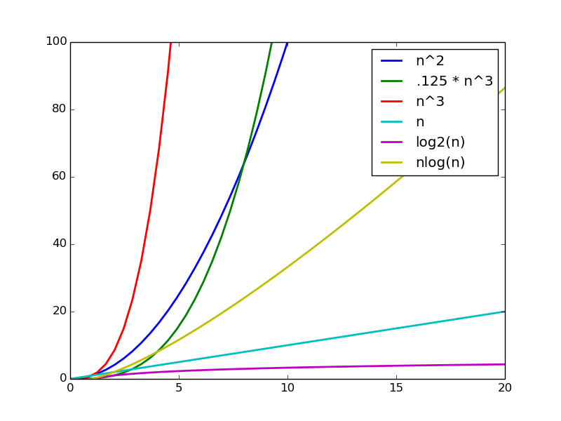
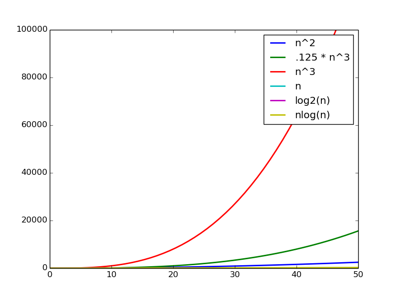
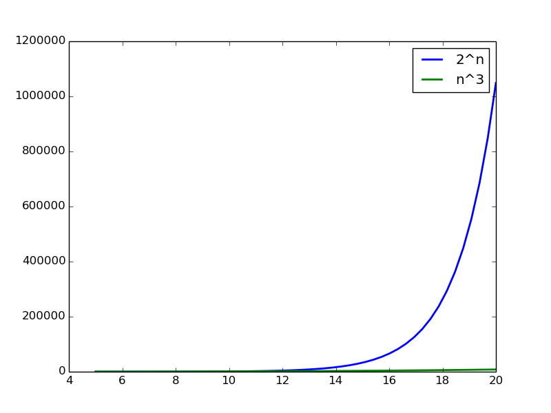
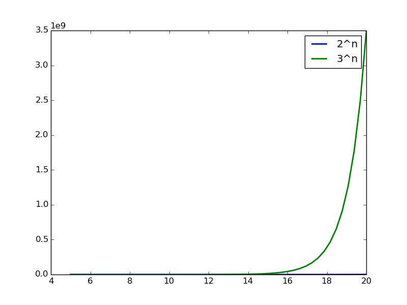

# 2021 pre-MOI培訓．第三節

<i>April 10, Prepared by M. Hong</i>

## 本節主題：算法分析入門，簡易OOP及STL

- 算法分析用語
    - 漸近分析記號--大O符號
    - 時間複雜度 --- "基本運算"執行的次數
        - 例子：插入排序
        - C++：1秒大概10^8次運算
    - 空間複雜度 --- 使用的變量等等佔的記憶體（或"內存"），初階OI通常不重視。
    - 最壞情況v.s.平均情況v.s.均攤分析（Optional:建中16講義第一講）
- 使用C++而不是C/Pascal等語言的好處：Standard Template Library (STL)。
    - 註：有些比賽允許使用Python或Java等 (MOI不能　)，但執行速度較低，建議摸熟C++。
    - 物件導向(或稱面向對象，Object-oriented)編程入門
    - 備註：使用keyword `enum`的方法。
- 標準模版庫(STL)的容器(Containter)：
    - class名為：`ClassName<Type>`。例如`vector<int>`，`vector<string>`,`priority_queue<int>`etc。
    - 講義3.3 迭代器(iterator)可以自行閱讀。
    - `vector`向量（動態陣列）
        - 使用方法：一維、二維、存取方法等
        - (選學，以後可能會講) 實現：動態陣列變長變短，均攤分析
        - 例子：圖的鄰接鏈表表示
    - `string`字串(又名`basic_string<char>`)
        - 使用方法
        - 例子
    - **Optional** `deque`雙頭隊列(double-ended queue)使用方法
    - **Optional** `list`列表(鏈表)
- 實題演練
    - MOI兩題。

**預計用時90-120分鐘，如有剩餘時間自行消化練習。**

## PPT內容

### 複習功課

1. (brute-force; linear scan)UVa 927 加法生成的整數序列：https://onlinejudge.org/index.php?option=com_onlinejudge&Itemid=8&category=24&page=show_problem&problem=868
2. (brute-force; two loops)UVa 10487 最近和：https://onlinejudge.org/index.php?option=com_onlinejudge&Itemid=8&category=24&page=show_problem&problem=1428
3. (?)UVa 11565 簡易方程式：https://onlinejudge.org/index.php?option=com_onlinejudge&Itemid=8&category=24&page=show_problem&problem=2612

### Time Complexity

- Count the number of all “basic” operations.

- What is “basic”?

- Additions, Multiplication,… 

- Even function call?

- Better know what you’re using

### Insertion Sort

```pseudocode
i ← 1

while i < length(A)

  j ← i

  while j > 0 and A[j-1] > A[j]

    swap A[j] and A[j-1]

    j ← j - 1

  end while

  i ← i + 1

end while
```

Credit: [Wikipedia Insertion Sort](https://en.wikipedia.org/wiki/Insertion_sort).

### Function Growth (i.e. Asymptotics)

- Polys
    
    
- Exp v. Poly
    
- Exps
    

Note: plotted by matplotlab. See attached code.

### Time Complexity (cont.)

- Count the number of “basic” operations.

- Usually only consider asymptotic(漸近)

- Big-O notation:

- f(n)=O(g(n)) iff when n is “large enough” f is always at most g (up to a multiplicative constant).

#### Examples

- 1.2n+n log⁡n+1.25n^3=O(n^3 )
- n^2+2^n=O(2^n)
- n^2.4+n^1.6=O(n^2.4)
- n+3+2n^2=O(n^3 ) (only an upper bound!)
- f=O(g) iff g=Ω(f).
- f=Θ(g) iff f=O(g) and f=Ω(g).
- “Loosely”O≈ ≤   Ω≈ ≥  Θ≈ =

#### Time Complexity (cont.)

- Count the number of “basic” operations.
- Usually only consider asymptotic(漸近).
- But concrete time cost **is** relevant in OI.
- \* Sometimes a difference in a factor of 2 can lead to the difference of a TLE (time limit exceeded) or AC verdict. (1s vs 2s)

### Space Complexity

- Memory “consumed” by programs

- Measured using MBs etc.

- Usually not a concern in OI (at least for beginners).

### Worst-case vs other

We usually consider worst-case in OI

- Test case will (by no doubt) contain those input

- Sometimes (interactive problems or GCJ problems) problems require only average case.

- Good to know but **optional** for now: amortized & random algo.

## C++ in OI

### C++

“Incremented” C

- +: Object-Oriented Programming (OOP)
    - Objects, methods and more… 
    - You are using them all the time… (cin/cout!)

- +: Template
    - Probably not every relevant in OI
    - Useful when you try to understand implementation of STL

### Object-Oriented Programming

Basic idea: 
 object = data + associated operations

Think about basic objects and their interactions when writing codes(!)

### Structures – Collection of Data

```c
struct TestTaker {

 string name;

 int score;

};

TestTaker a,b,c;

scanf(“%s %d”, &a.name, &a.score);
```

### Functions for handling data

```C
TestTaker  a[100];
scanf(“%s %d”, &a.name, &a.score);
void print_name(TestTaker &p) {
  printf(“%s\n”, p.name);
}
void add_score(TestTaker &p, int d) {
  p.score += d;
}
```

### Class and Objects

Combines both data and associated functions (“methods”). In OI, we can always safely use the keyword struct. Here a is called an instance of the class or an object.

```c++
struct/class TestTaker {
public:
  string name;
  int score;
  void print_name() 
     printf(“%s\n”, name);
  }
  void add_score(int d) {
    score += d;
  }
};

TestTaker  a;
scanf(“%s %d”, &a.name, &a.score);
a.print_name();
a.add_score(100);
```

### Why C++ in OI?

- Speed (over Python and Java) TLE vs AC

- Powerful **Standard Template Library**

- Often the only supported language (MOI).

- PASCAL is too old-school… I doubt if anyone still uses it in practice.

## Basic **STL**

### __**Standard Template Library**__

Basically a bunch of code others wrote for you…

- Extremely useful in OI(!!)

- Support binary search, binary search tree (BST), quick sort and merge sort etc… Most of the time, you don’t need to learn to code any of these(!)

- Refer to e.g. [www.cplusplus.com](http://www.cplusplus.com/) (see also markdown notes).

### **Standard Template Library**

Not enough time today… 

Let’s only introduce the most basic containers today --- 

- `vector<T>` (also known as dynamic arrays).

- `string`

- `deque<T>` and `list<T>` **(optional)**

#### Vector

Dynamic arrays. Length can change during runtime (c.t. array like `T[10]`)

Interface:

- `vector<T> v(size_type n, const T &b);`
     Creates a vector v with n elements, each initialized to b. Time O(n)

- `v[i]` : access i-th element. If i not in [0,n), behavior is undefined. Time O(1)

- `v.size()`: return the number of elements. O(1)

- `v.push_back(T a)`: append the element a at the end of v. effectively increasing v.size() by 1. O(1)

- `v.pop_back()`: Remove last element. Note: if vector is empty, behavior is undefined. O(1)

- `v.clear()`: clear the contents, changes the vector to be empty. O(size).

- `v.resize(a, b)`: set the size of v to a. Newly added elements initialized to b. May delete elements if a<size. O(|size -a|).

Other properties (like how they’re implemented) will be taught in later lectures if we have time…

#### **string** **(alias of** `basic_string<char>`)

Specialized container for characters Usage very similar to `vector<char> `(e.g. `s[i]`).

Some useful extra operations:

- `s = t`: assigns t to s. Time usually O(len(s)+len(t)).
- `s += t`: append t to s. Time usually O(len(s)+len(t)).

- `s.c_str()`: return a C string (char[]). O(1)
- `s (<, >, == etc) t`: return alphabetic order
- `cin >>s; cout <<s;` etc
- `getline(cin, s, char c)`: read string from cin until character c. Default value for c is “\n”.

## Past Problems

Warning --- full score can be hard.

1. MOI 2018 Serial 數列和
    提示：利用數學性質
2. MOI 2020 range 重覆數字
    提示：暴力排序，或者利用數字的range很小這一條件。

## 參考資料

### Cplusplus.com

https://www.cplusplus.com/reference/

例如vector的API可以在https://www.cplusplus.com/reference/vector/vector/ 找到。

## Cppreference.com

https://en.cppreference.com/w/

另一個常用的reference網，可以視情況使用。

### 香港代表隊培訓講義

https://assets.hkoi.org/training2019/big-o.pdf

### 建國中學校內培訓講義：

1. 09年：http://pisces.ck.tp.edu.tw/~peng/index.php?year=2009
2. 16年：https://tioj.ck.tp.edu.tw/articles/5

