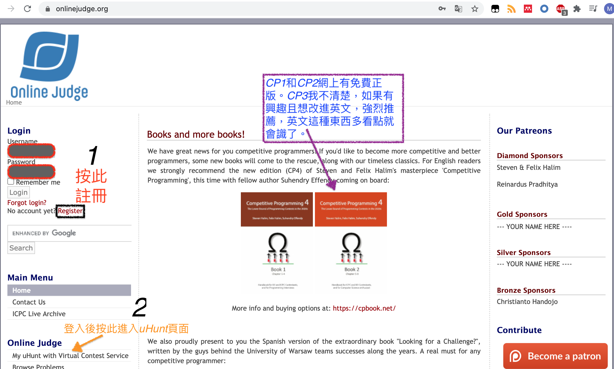
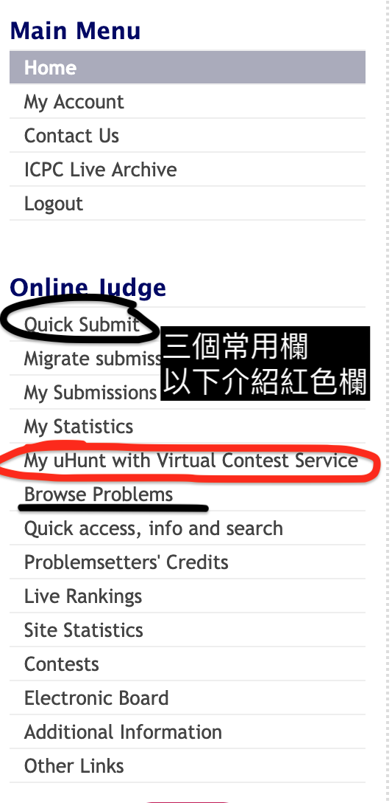
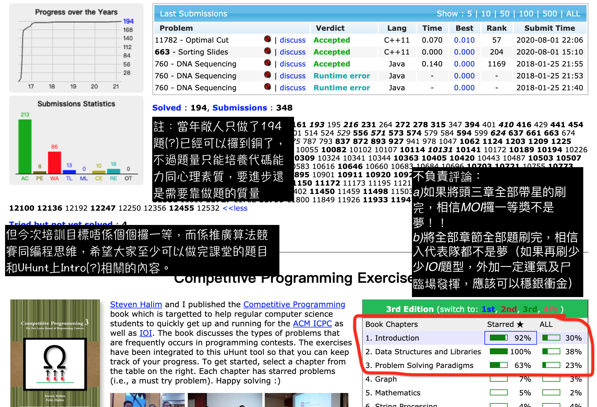
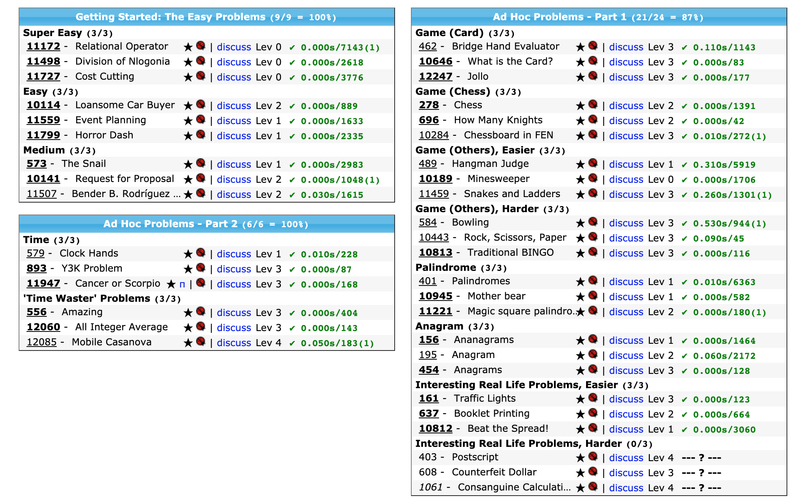

# 2021 pre-MOI培訓．第一節

<i>April 2, Prepared by M. Hong</i>

## Some logistics:

- 時間：全澳賽(5月上旬)之前，即4-5月。每周末10時至12時。
- 講師：Hong & Hong
- 內容：OI比賽，編程思想基礎內容
- 地點：線上授課平台(如無意外是Zoom)

## 本節主題：工欲善其事必先利其器

本節內容主要為複習語言和編程思想，講者假設聽眾有一定C++基礎。對於完全零基礎的新手而言，一個不錯的資源是 **https://oi-wiki.org/lang**。

<i>註：課堂大網順序不必然表示講授順序。</i>

*註：標有**進階**的項目表示不是MOI必須掌握的知識點，但掌握了可能會有微妙的優勢。*

- 介紹基本編程思想
    - 複習基礎C++內容
        - 全局變量與局部變量，賦值
        - 函數及函數呼叫（包括遞歸）
        - 基本控制語句，如for, if, while等
        - 標準函數庫函數（包括STL的cin, cout)等使用方法
        - **進階：**記憶體地址和指針
    - 程序執行原理
    - 一些專有名詞，如編譯、執行、除錯的意思
- 熟習基本編程工具，如IDE，Compiler，Editor等（參照上一段）。
    - 介紹Code::Blocks的Compile, Run, Debug等操作。
    - **IDE內的Debugger很重要(!!!)**希望大家掌握使用方法。
        （學會全面使用IDE的功能可大幅提高學習效率）
    - **進階：**使用command line (~~建議先卸載windows仲可以防止沉迷打機~~)
        在cmd上使用g++, gdb等工具
- 簡易入門OI題，例如使用暴力模擬等基本方法的題型。
    - 多重循環(for, while等)
    - 簡單函數體回溯(back-tracking)
    - 工程代碼題等等。

**預計用時60至90分鐘，剩餘時間自行消化練習。**

## 隨堂練習

1. (遞歸)TIOJ1003切意大利餅問題：https://tioj.ck.tp.edu.tw/problems/1003 。
2. (模擬)TIOJ1004猶太人敢死隊問題：https://tioj.ck.tp.edu.tw/problems/1004。
    註：又稱[Josephus（約瑟夫斯）問題](https://en.wikipedia.org/wiki/Josephus_problem)。

## 課後習題

## 公開OJ列表

- 參考建國中學講義
    即 [09第一周講義](http://pisces.ck.tp.edu.tw/~peng/index.php?action=showfile&file=f25eb3f19f79528650026465de4ab6e5fd0be85b3) 及 [16第一周講義]([1_2.pdf (480 KB)](https://tioj.ck.tp.edu.tw/uploads/attachment/5/12/1_2.pdf))列出的OJ。例如耳熟能詳的洛谷OJ，UOJ，TIOJ，UVaOJ等。
- 強推UVaOJ，題目多到可以刷到天荒地老
    **UVaOJ一個很煩人的地方是題目的格式要求很嚴格，很多時候不可以有多餘空格和換行等，請注意**
    可以配合UDebug (內建UVa上很多題目的標準程序，可以用於對比你的程式和標準輸出的差異)，效率會更高。
    1. 
    2. 
    3. 
    4. 如果可以做到以下程度，相信應對MOI的基礎技能已經足夠了。
    5. 

## 參考資料

### OI Wiki

https://oi-wiki.org/

### 香港代表隊培訓講義

https://assets.hkoi.org/training2019/big-o.pdf

### 建國中學校內培訓講義：

1. 09年：http://pisces.ck.tp.edu.tw/~peng/index.php?year=2009
2. 16年：https://tioj.ck.tp.edu.tw/articles/5

